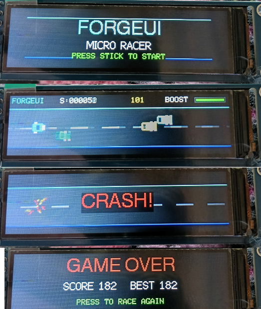
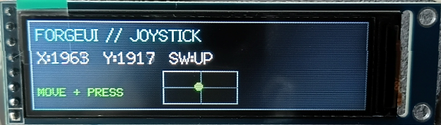

# ForgeUI MicroRacer — ESP32-S3 + ST7789 284×76

ForgeUI MicroRacer is a physically tested, joystick-controlled mini racing game and graphical showcase for an ESP32-S3 and an ultra-wide 2.25-inch ST7789 76×284 IPS TFT.

**PHYSICAL GAME PASS — ESP32-S3 + ST7789 + ANALOG JOYSTICK**

The hero photo is physical evidence of the complete game lifecycle: **TITLE → GAMEPLAY → CRASH → GAME OVER**.

## Gameplay

Start from the ForgeUI MicroRacer title screen with a joystick press, steer through traffic, use boost when needed, and race for a higher score. A collision triggers the crash animation, followed by the game-over screen with the current and best scores. Press the joystick again to race again.

The physically proven implementation includes:

- ForgeUI MicroRacer title screen and joystick press to start
- Automatic joystick centre calibration and a joystick dead zone
- X/Y steering
- Full-screen 16-bit `TFT_eSprite` rendering
- Scrolling road and lane markers
- Traffic with increasing speed and difficulty
- Score and best score
- Boost, boost recharge, and joystick-button boost
- Collision detection, crash particles, and a CRASH state
- GAME OVER state and press-to-restart flow
- Approximately 30 FPS target loop

## Controls

| Input | Action |
|---|---|
| Joystick X/Y | Steer the car |
| Joystick press | Start a race, activate boost while racing, or restart after game over |

## Physical Joystick Proof

The analog joystick was independently validated on the physical hardware before integration into MicroRacer: X movement, Y movement, push switch, and display stability all passed.

### Final proven joystick mapping

| Joystick | ESP32-S3 |
|---|---:|
| SW | GPIO4 |
| VRy | GPIO5 |
| VRx | GPIO6 |
| +5V-labelled supply | 3.3V |
| GND | GND |

The joystick module's **+5V-labelled supply pin is intentionally powered from the ESP32-S3 3.3V rail** in this project. GPIO7 remains spare.

## Hardware and display wiring

### MCU

- ESP32-S3 DevKitC-1
- ESP32-S3 silicon revision v0.2
- 8 MB embedded PSRAM physically detected

### Display

- Controller: ST7789
- 2.25-inch IPS TFT
- Native resolution: 76×284
- Game orientation: 284×76 landscape
- SPI at 27 MHz

### Physically proven display wiring

| TFT display | ESP32-S3 | Function |
|---|---:|---|
| GND | GND | Ground |
| VCC | 3.3V | Display power |
| SCL / SCLK | GPIO12 | SPI clock |
| SDA / MOSI | GPIO11 | SPI data |
| RST | GPIO10 | Reset |
| DC | GPIO9 | Data / command |
| CS | GPIO8 | Chip select |
| BL | GND | Active-low backlight enable |
| MISO | Unused | — |

The tested display module has an active-low backlight input, so BL is connected to GND. Other ST7789 modules may use different backlight circuitry.

## Proven display configuration

| Setting | Proven value |
|---|---|
| Driver | ST7789 |
| Native geometry | 76×284 |
| Landscape viewport | 284×76 |
| Rotation | 1 |
| Display inversion | `false` |
| SPI frequency | 27 MHz |
| MOSI / SCLK | GPIO11 / GPIO12 |
| CS / DC / RST | GPIO8 / GPIO9 / GPIO10 |
| Backlight | Active-low, connected to GND |

## Supporting original display bring-up proof

This earlier physical result records the validated display wiring, orientation, and ST7789 configuration that underpin MicroRacer. For the standalone hardware baseline, see the related hardware-reference project below.

## Software and build information

This project uses PlatformIO with the Arduino framework for ESP32. The physically proven configuration is held in `platformio.ini`; the game implementation is in `src/main.cpp`.

## ForgeUI Hardware Lab

MicroRacer is part of the ForgeUI Hardware Lab: practical, physically tested ESP32 hardware projects that demonstrate real display and input integrations. It is technical documentation for a proven game configuration first, while also serving as a compact graphical showcase for ForgeUI-compatible hardware exploration.

## Related ForgeUI projects

- [ForgeUI](https://forgeui.co.nz)
- [ForgeUI Studio](https://studio.forgeui.co.nz)
- [ST7789 284×76 hardware reference](https://github.com/RTechAI/forgeui-hw-st7789-284x76-wide)
- [MicroDash graphical showcase](https://github.com/RTechAI/forgeui-hw-st7789-284x76-wide-microdash)

## Third-party dependency attribution

This project depends on [TFT_eSPI-ST7789-76x284](https://github.com/atoomnetmarc/TFT_eSPI-ST7789-76x284.git), maintained by atoomnetmarc. It is an external third-party dependency that provides support for this unusual ST7789 panel geometry. ForgeUI does not claim ownership of that library or fork; it retains its own copyright and licence terms.

## License and repository scope

Unless otherwise noted, ForgeUI-authored source and documentation in this repository are available under the [MIT License](LICENSE). Third-party dependencies and reference implementations remain subject to their respective licences and copyright.
